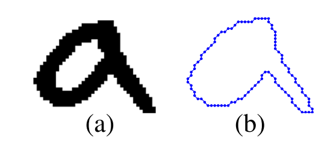
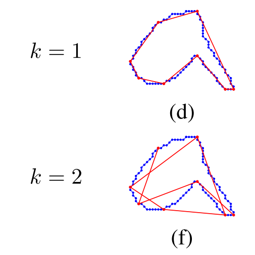
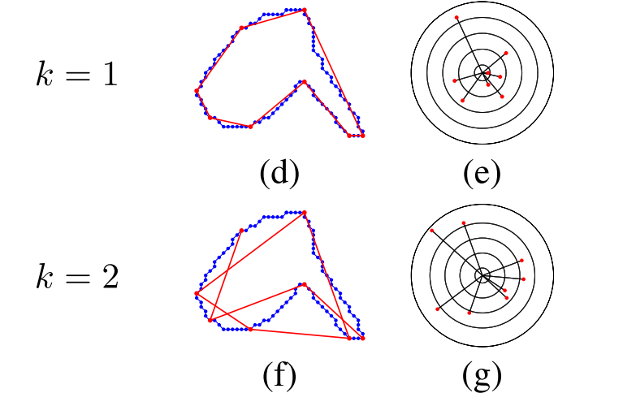
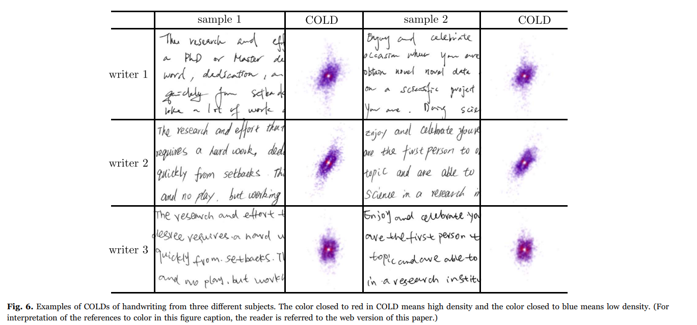
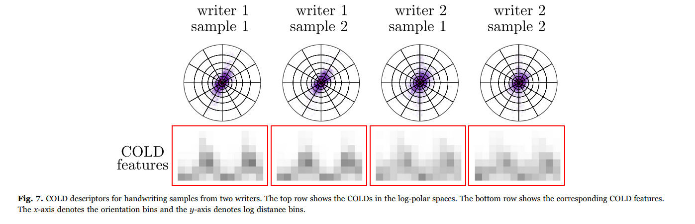

# COLD Features
### First we will consider two facts
- The contours of connected components of handwritten texts contain the individual's handwriting style info ,such as writing slant and curvature

- Based on the fact that every digital curve is composed of digital line
segments, we decompose contours into maximal digital line
segments by finding the dominant points on contours. This method
is also known as <b>polygonal approximation</b> and is widely used in
handwriting recognition

(They will be explanied)
### How COLD works ?

- Extract the contour of the connected component as following :

- Given an ink contour S and the ordered sequence of n dominant points from the contour , line segments
can be obtained between every pair of the dominant points (pi , pi+1) , where k denotes the distance on the dominant point sequence
<b>If k=1 the point P will be connected to the next point besides it in CCW , if k=2 it will skip one point and will be connected to the one after it </b>

- Each line corresponds to a point (θ,ρ) in the polar coordinate space ,  and all line segments from one handwritten document can form a distribution, termed <b>cloud of line distribution (COLD)</b>
θ,ρ are calculated depending on some equation

- When k = 1, the line segments are the polygon estimation of the contours and the corresponding COLD reflects the slant and curvature-based information of contours

- in a more round handwriting, the lengths of line segments are short in all directions and the COLD has a high density around the
origin

- This figure shows the COLDs of handwriting samples with k = 1 from three different writers

We can observe the following
    - Samples from the same hand have the similar line distributions
    - Samples from different writers have different distributions
    - The differences of the COLDs are from the different densities
    - Densities in the regions closed to the center (the origin point) are high, which indicates that there are more short lines in handwritten documents
    - Points in the regions far away from the center are sparse and the prevalent orientation corresponds to the slant of writing.
    - The centralized COLD corresponds to the high curvature handwriting while the scattered COLD corresponds to the irregular-curvature handwriting <b>!! Which is the main part of our problem that we depend that males writings are more slanted and unorganized than females</b>

